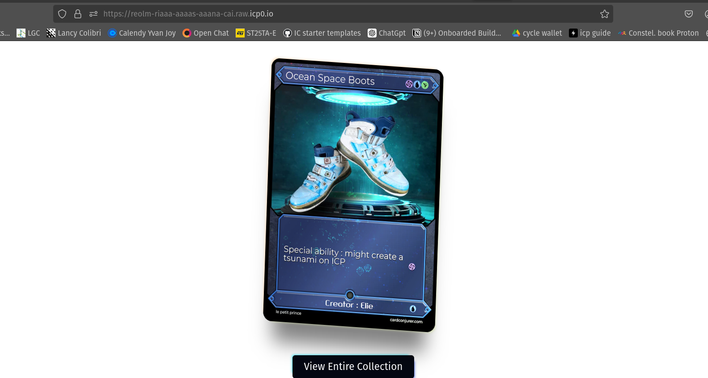

# RAVE Assets with ONE canister only

This repository is a simple example of a RAVE asset made with one canister ONLY (full motoko). RAVE stands for Real Asset Virtually Extended, which is a concept for associating real-world items with their digital twins using canister smart contracts on the Internet Computer (ICP).

## Example

You can view an example [here](https://reolm-riaaa-aaaas-aaana-cai.raw.icp0.io/).

